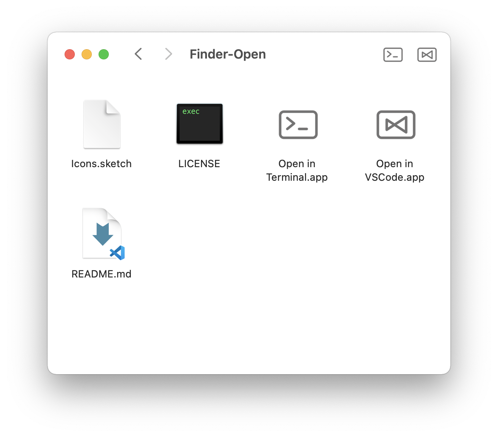

# Finder-Open

macOS 脚本编辑器实现快速在其他程序中打开当前 Finder 目录

> 网上找到一些类似的，个人感觉不是不好用，就是外观与 Finder 工具栏其他内容不太匹配，或是增加其他程序不方便，我就自己动手设计图标，并用 macOS 自带脚本写了这些小程序，方便使用。

**食用方法**

按住 Command 并拖动 APP 到 Finder 工具栏上，即可
Finder 中直接点击工具栏上的图标即可打开当前目录

**目前实现**

在 VSCode 中打开当前目录
在 终端 中打开当前目录

**如何自定义**

拖动 APP 到 macOS 自带的脚本编辑器上，即可查看源代码并修改。源码是 JavaScript 语言。
